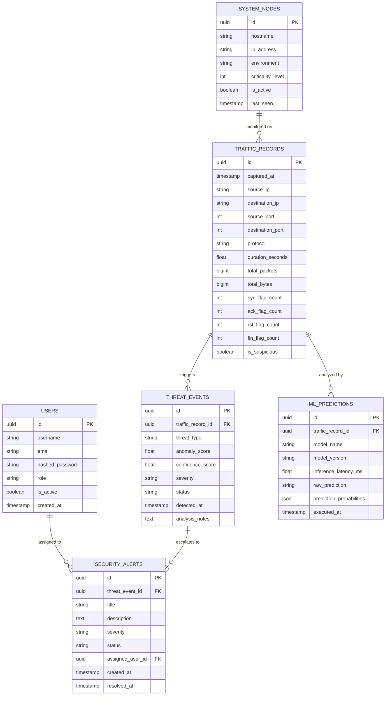

# Database Architecture & Entity Specifications

## 1. Overview

The database layer is engineered with **SQLAlchemy 2.0 ORM** to ensure full portability between:
1. **SQLite (Development / Testing):** Lightweight, zero-configuration file-based storage (`./network_ids.db`).
2. **PostgreSQL (Production):** High-throughput, concurrent relational engine supporting partitioning and advanced indexing.

---

## 2. Entity Relationship Diagram (ERD)

---

## 3. Data Dictionary

### Table: `traffic_records`
Stores every captured network flow or parsed telemetry item.
- `id` (UUID, Primary Key): Unique flow identifier.
- `captured_at` (DateTime, Indexed): Timestamp of flow occurrence.
- `source_ip` (String(45), Indexed): Source IPv4 or IPv6 address.
- `destination_ip` (String(45), Indexed): Destination IPv4 or IPv6 address.
- `source_port` (Integer): Client port (0–65535).
- `destination_port` (Integer, Indexed): Service port (0–65535).
- `protocol` (String(10), Indexed): Layer 4 protocol (TCP, UDP, ICMP, etc.).
- `duration_seconds` (Float): Flow duration.
- `total_packets` (BigInteger): Total packets exchanged in flow.
- `total_bytes` (BigInteger): Total bytes exchanged.
- `syn_flag_count` (Integer): Count of TCP SYN packets.
- `ack_flag_count` (Integer): Count of TCP ACK packets.
- `rst_flag_count` (Integer): Count of TCP RST packets.
- `fin_flag_count` (Integer): Count of TCP FIN packets.
- `is_suspicious` (Boolean, Default False): Fast-filter boolean flag.

### Table: `threat_events`
Stores security anomalies and classified threats detected in traffic flows.
- `id` (UUID, Primary Key): Threat event identifier.
- `traffic_record_id` (UUID, Foreign Key -> `traffic_records.id`): Associated network flow.
- `threat_type` (String(50), Indexed): Classification category (`DoS`, `PortScan`, `BruteForce`, `Anomaly`, `Infiltration`).
- `anomaly_score` (Float): Outlier deviation score computed by unsupervised model.
- `confidence_score` (Float): Probability assigned by classifier (0.0 to 1.0).
- `severity` (String(20), Indexed): `LOW`, `MEDIUM`, `HIGH`, or `CRITICAL`.
- `status` (String(30), Default 'DETECTED'): `DETECTED`, `INVESTIGATING`, `MITIGATED`, `DISMISSED`.
- `detected_at` (DateTime, Indexed): Timestamp when anomaly was flagged.
- `analysis_notes` (Text): Diagnostic information or trigger rule explanation.

### Table: `security_alerts`
Actionable notifications presented on the SOC dashboard for triage and response.
- `id` (UUID, Primary Key): Unique alert identifier.
- `threat_event_id` (UUID, Foreign Key -> `threat_events.id`): Parent threat event.
- `title` (String(150)): Succinct alert heading (e.g., "High-Volume SYN Flood Detected").
- `description` (Text): Detailed context including source IP and targeted service.
- `severity` (String(20), Indexed): `LOW`, `MEDIUM`, `HIGH`, `CRITICAL`.
- `status` (String(30), Indexed): `NEW`, `ACKNOWLEDGED`, `RESOLVED`, `FALSE_POSITIVE`.
- `assigned_user_id` (UUID, Nullable, Foreign Key -> `users.id`): SOC analyst assigned.
- `created_at` (DateTime, Indexed): Timestamp of creation.
- `resolved_at` (DateTime, Nullable): Timestamp when marked resolved.

### Table: `ml_predictions`
Audit trail of machine learning inference operations for governance and drift monitoring.
- `id` (UUID, Primary Key): Prediction log identifier.
- `traffic_record_id` (UUID, Foreign Key -> `traffic_records.id`): Associated flow.
- `model_name` (String(80)): Name of model (e.g., `isolation_forest_ids_v1`).
- `model_version` (String(20)): Artifact version string.
- `inference_latency_ms` (Float): Time taken to compute inference.
- `raw_prediction` (String(100)): Class label or numerical flag.
- `prediction_probabilities` (JSON / Text): Array or map of class probabilities.
- `executed_at` (DateTime, Indexed): Time of inference.

### Table: `system_nodes`
Inventory of internal servers, gateways, and subnets being monitored.
- `id` (UUID, Primary Key): Node identifier.
- `hostname` (String(100)): Name of monitored host.
- `ip_address` (String(45), Unique): Primary IP address.
- `environment` (String(30)): `production`, `staging`, `internal_dmz`.
- `criticality_level` (Integer): Asset weighting (1=Low, 2=Medium, 3=High, 4=Mission-Critical).
- `is_active` (Boolean): Monitoring status.
- `last_seen` (DateTime): Last telemetry heartbeat.

### Table: `users`
Security personnel accounts for accessing SOC dashboard and managing alerts.
- `id` (UUID, Primary Key): User identifier.
- `username` (String(50), Unique, Indexed): Login username.
- `email` (String(120), Unique): Email address.
- `hashed_password` (String(255)): Bcrypt/Argon2 password hash.
- `role` (String(30)): `analyst`, `admin`, `auditor`.
- `is_active` (Boolean): Account state.
- `created_at` (DateTime): Creation timestamp.

---

## 4. Indexing & Optimization Strategy
1. **Compound Indexes:** `(source_ip, destination_port)` on `traffic_records` for fast port scan queries.
2. **Time-series Indexes:** `(captured_at DESC)` and `(detected_at DESC)` for efficient pagination on dashboard feeds.
3. **Partitioning (PostgreSQL):** Range-partitioning on `traffic_records` by monthly `captured_at` for high-volume retention.
