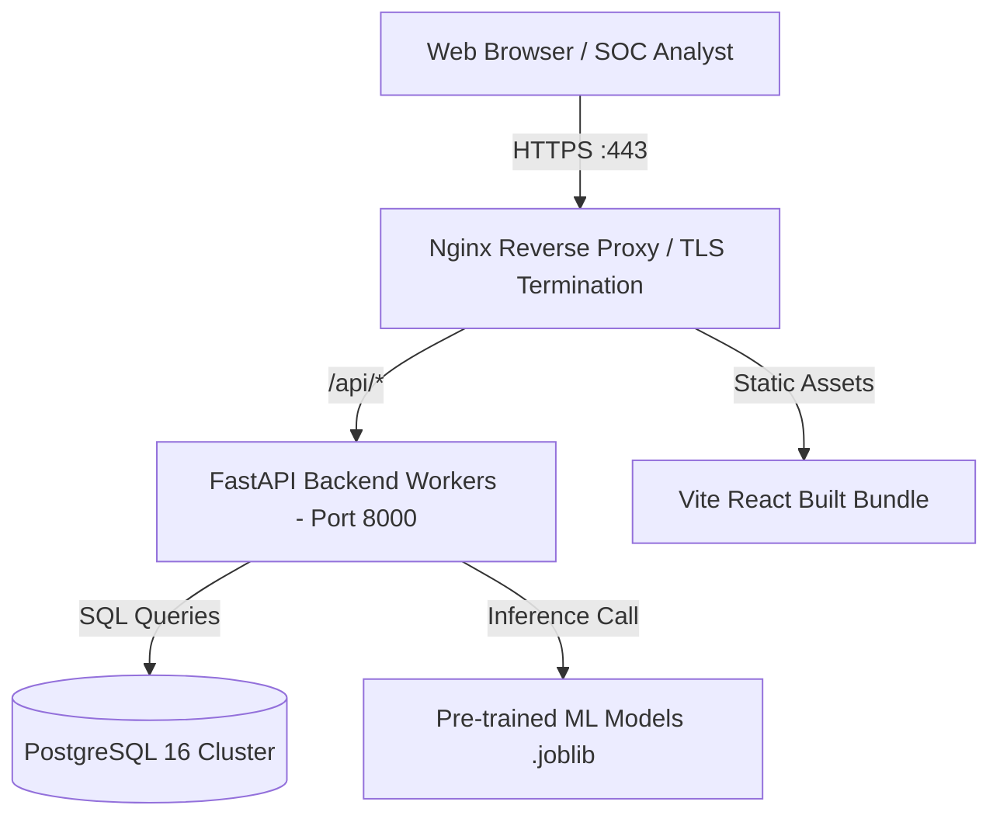

# Deployment & Environment Guide

## 1. Environment Strategy

The application employs 12-factor application design principles:
- Environment parameters are decoupled from source code and maintained via `.env` files and OS environment variables.
- Pydantic Settings (`backend.app.core.config.Settings`) enforces strict validation, type casting, and defaults.

### Environment Modes
1. **`development`**:
   - Database: SQLite file (`./network_ids.db`) for rapid iteration without external infrastructure.
   - CORS: Open to `http://localhost:5173` and `http://127.0.0.1:5173`.
   - Logging: `DEBUG` / `INFO` level.
   - Reload: FastAPI hot-reloading enabled.
2. **`production`**:
   - Database: PostgreSQL with SSL and connection pooling.
   - CORS: Restricted to production SOC domain.
   - Logging: `INFO` / `WARNING` with file rotation and audit trails.
   - Server: ASGI server (Uvicorn / Gunicorn with multiple workers).

---

## 2. Local Development Execution

### Prerequisites
- Python 3.12+
- Node.js 20+ LTS

### Backend Execution
```bash
# 1. From root directory, initialize environment file
copy .env.example .env

# 2. Install dependencies
pip install -r requirements.txt

# 3. Start FastAPI server
uvicorn backend.app.main:app --reload --host 127.0.0.1 --port 8000
```

### Frontend Execution
```bash
# 1. Navigate to frontend
cd frontend

# 2. Install dependencies
npm install

# 3. Start Vite dev server
npm run dev
```

---

## 3. Production Deployment Blueprint (Docker)



### Database Connection Strings
- **SQLite (Dev):** `sqlite:///./network_ids.db`
- **PostgreSQL (Prod):** `postgresql+psycopg2://<user>:<password>@<host>:5432/<database>`
